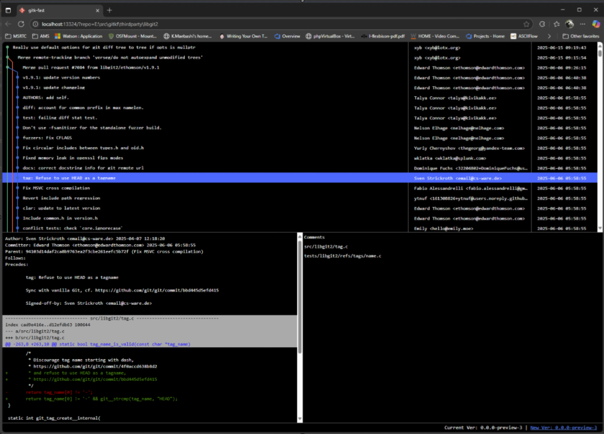

gitkf - gitk-fast
==

`gitk` is awesome, but performance is not good for huge repository. This project is trying to provide a gitk like tool and resolve the performance pain point.

### Run

Just go to a repro, run:

    gitkf

or

    gitkf .

or

    gitkf <subfolder or file>

### Screenshot

